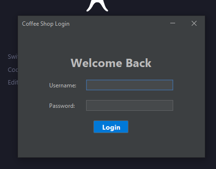
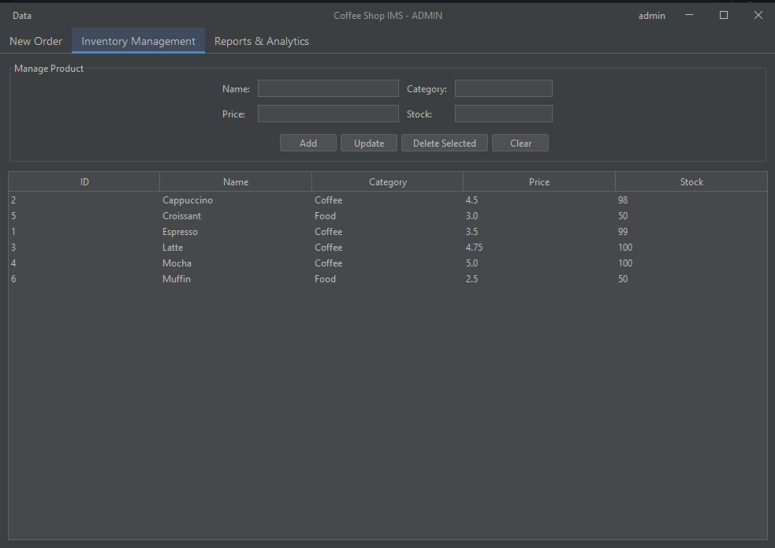

# ☕ Coffee Shop Management System


A robust, desktop-based **Inventory Management and Point of Sale (POS) System** designed specifically for coffee shops. This application streamlines daily operations, from order processing to stock management and sales reporting.

## ✨ Key Features

*   **🔐 Role-Based Access Control**
    *   **Admin**: Full access to Inventory, Sales Reports, and User Management.
    *   **Staff**: Restricted access focused on Order Processing (POS).
*   **🛒 Point of Sale (POS)**
    *   User-friendly interface for quick order taking.
    *   Support for **Cash** and **Card** payments.
    *   Automatic tax and total calculation.
*   **📦 Inventory Management**
    *   Real-time stock tracking.
    *   Add, update, and delete products easily.
    *   Automatic stock deduction upon sale.
*   **📄 Digital Receipts**
    *   Auto-generates professional PDF receipts for every transaction.
    *   Saves receipts automatically to a local folder.
*   **📊 Analytics Dashboard**
    *   Visual sales reports (Total Sales, Cash vs. Card).
    *   Instant order history preview.
*   **🎨 Modern UI**
    *   Built with **FlatLaf** for a sleek, dark-themed, modern aesthetic.
*   **💾 Portable Database**
    *   Powered by **SQLite** - no complex database installation required.
    *   Plug-and-play capability.

## 🛠️ Built With

*   **Language**: Java (JDK 8+)
*   **GUI Framework**: Swing
*   **Database**: SQLite
*   **Build Tool**: Apache Maven
*   **Libraries**:
    *   *FlatLaf* (UI Theme)
    *   *OpenPDF* (PDF Generation)
    *   *SQLite JDBC* (Database Driver)

## 🚀 Getting Started

### Prerequisites
*   Java Development Kit (JDK) 8 or higher installed.
*   Maven installed (for building from source).

### Installation

1.  **Clone the repository**
    ```bash
    git clone https://github.com/yourusername/coffee-shop-ims.git
    cd coffee-shop-ims
    ```

2.  **Build the project**
    ```bash
    mvn clean package
    ```

3.  **Run the Application**
    *   **Via Command Line:**
        ```bash
        java -jar target/inventory-system-1.0-SNAPSHOT.jar
        ```
    *   **Via One-Click Launcher (Windows):**
        Navigate to the `release` folder and double-click `Setup.bat` to create a desktop shortcut.

## � Screenshots





*(The application includes a comprehensive dashboard for managing inventory and viewing sales reports.)*

## 🤝 Contributing

Contributions are welcome! Please feel free to submit a Pull Request.

1.  Fork the Project
2.  Create your Feature Branch (`git checkout -b feature/AmazingFeature`)
3.  Commit your Changes (`git commit -m 'Add some AmazingFeature'`)
4.  Push to the Branch (`git push origin feature/AmazingFeature`)
5.  Open a Pull Request

## 📄 License

This project is licensed under the MIT License - see the [LICENSE](LICENSE) file for details.

---
*Developed with ❤️ by [Riad Hossain]*
